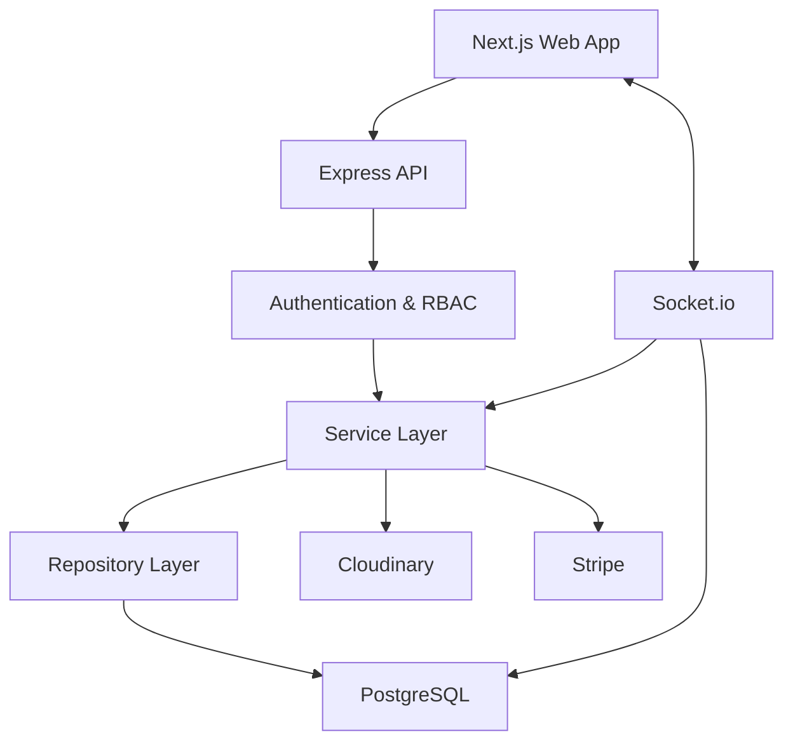

# CampusTrade

> A multi-college, trusted campus marketplace for buying and selling items within verified college communities.

CampusTrade is a full-stack marketplace platform designed around a simple idea: **students should be able to trade with people inside their own college ecosystem**.

Instead of treating a marketplace as a completely open network, CampusTrade uses verified college identities, college-scoped listings, role-based administration, real-time communication, transactional orders, Stripe payments, and moderation workflows to create a more controlled trading environment.


---

## Table of Contents

- [Problem](#problem)
- [Goals](#goals)
- [Core Features](#core-features)
- [Users and Roles](#users-and-roles)
- [High-Level Architecture](#high-level-architecture)
- [Backend Architecture](#backend-architecture)
- [Database Architecture](#database-architecture)
- [Authentication and Authorization](#authentication-and-authorization)
- [Multi-College Isolation](#multi-college-isolation)
- [Marketplace and Listings](#marketplace-and-listings)
- [Listing Images](#listing-images)
- [Product Details](#product-details)
- [Wishlist](#wishlist)
- [Real-Time Chat](#real-time-chat)
- [Orders](#orders)
- [Payments](#payments)
- [Refunds and Reconciliation](#refunds-and-reconciliation)
- [Admin Panel](#admin-panel)
- [Reports and Moderation](#reports-and-moderation)
- [Concurrency and Transactions](#concurrency-and-transactions)
- [API Inventory](#api-inventory)
- [Project Structure](#project-structure)
- [Environment Variables](#environment-variables)
- [Local Development](#local-development)
- [Testing](#testing)
- [Security](#security)
- [Architectural Decisions](#architectural-decisions)
- [Tradeoffs and Limitations](#tradeoffs-and-limitations)
- [Git Workflow](#git-workflow)
- [Current Status](#current-status)
- [Future Roadmap](#future-roadmap)

---

## Problem

General-purpose marketplaces have several problems when used for student-to-student trading:

- Buyers and sellers may be far apart.
- Meeting and pickup logistics become inconvenient.
- Users have limited context about who they are dealing with.
- Scam and fake-listing risks are difficult to control.
- A generic marketplace does not naturally understand college-level communities.

CampusTrade approaches the problem by making the marketplace **college-centric**.

---

## Goals

The platform is designed around:

1. **Verified college communities** — users enter through a college identity/domain and approval workflow.
2. **College-scoped trading** — marketplace interactions are associated with a user's college.
3. **Safe transactions** — orders reserve listings and maintain explicit state transitions.
4. **Real-time communication** — buyers and sellers can communicate through Socket.io.
5. **Moderation** — administrators can manage users, listings, payments, and reports.
6. **Data consistency** — important state changes use conditional database updates and transactions.

---

## Core Features

### Authentication and Accounts

- College email/domain validation
- Email verification
- College approval workflow
- Access and refresh JWTs
- bcrypt password hashing
- Current database account-status validation
- Role-based authorization
- User suspension support

### Marketplace

- Listing creation and editing
- Draft listings
- Publishing
- Categories
- Conditions
- Search
- Filtering
- Sorting
- Pagination
- Soft deletion
- Product detail pages
- Atomic view counters

### Images

- Cloudinary storage
- Multer upload handling
- Multiple images per listing
- Primary image
- Display ordering
- Image deletion and Cloudinary cleanup

### Communication

- Real-time Socket.io chat
- Persistent conversations
- Persistent messages
- Typing indicators
- Read receipts
- Multi-socket delivery

### Wishlist

- Add/remove wishlist items
- Wishlist existence checks
- Paginated wishlist
- Unique user-item relationship
- Maintained wishlist counters

### Orders and Payments

- Item reservation
- Order lifecycle
- Historical price/title snapshots
- Stripe PaymentIntents
- Signed Stripe webhooks
- Payment state tracking
- Refunds
- Refund reconciliation

### Administration

- Platform-wide dashboard
- College-scoped dashboard
- User management
- Listing moderation
- Order inspection
- Payment inspection
- Refund operations
- Reports
- Report resolution
- Report-triggered listing/user moderation

---

## Users and Roles

The current Prisma `Role` enum defines three roles:

| Role | Scope | Main capabilities |
|---|---|---|
| `USER` | Student | Buy/sell items and use marketplace features |
| `COLLEGE_ADMIN` | One college | Moderate users, listings and reports within the assigned college |
| `PLATFORM_ADMIN` | Platform | Platform-wide administration and aggregate statistics |

> **Implementation note:** The repository inventory uses `USER` for the student role. This is the current schema value documented by the repository inspection.

### User lifecycle

Account states include:

```text
PENDING_VERIFICATION
        ↓
PENDING_COLLEGE_APPROVAL
        ↓
ACTIVE
```

Moderation-related states include:

```text
SUSPENDED
BANNED
REJECTED
```

Exact transitions are controlled by the implemented authentication and moderation logic.

---

## High-Level Architecture



The repository follows a monorepo structure:

```text
CampusTrade/
├── apps/
│   ├── web/
│   └── server/
└── ...
```

The backend follows a layered design:

```text
Routes
   ↓
Middleware
   ↓
Controllers
   ↓
Services
   ↓
Repositories
   ↓
Prisma
   ↓
PostgreSQL
```

External integrations such as Stripe and Cloudinary are handled from the application/service layer.

---

## Backend Architecture

### Routes

Defines API endpoints and middleware chains.

### Middleware

Handles cross-cutting request concerns such as:

- Authentication
- Role authorization
- Zod validation

Important middleware includes:

```text
authenticate
authorizeRoles
validate
```

### Controllers

Responsible for:

- Extracting request parameters/body/query
- Resolving authenticated-user context
- Calling services
- Formatting responses

Controllers are intentionally kept separate from core business logic.

### Services

Contain:

- Business rules
- State-transition validation
- Transaction orchestration
- External service interaction
- Authorization-related domain checks

### Repositories

Contain:

- Prisma queries
- Database filtering
- Pagination
- Aggregations
- Conditional state mutations

This separation is especially useful for enforcing college-scoped queries and atomic state transitions consistently.

---

# Database Architecture

CampusTrade uses:

- **PostgreSQL**
- **Prisma ORM**

The inspected schema contains major entities including:

```text
College
Category
User
EmailVerificationToken
AdminInvitation
RefreshSession

Item
ItemImage
Wishlist

Order
Payment

Conversation
Message
Notification

Report
Review
```

### Important database design characteristics

- Soft deletion through `deletedAt` on major entities
- Foreign-key relationships between business entities
- Unique constraints for important relationships
- Indexes for frequently queried fields
- `collegeId` stored directly on important college-scoped entities

### Major relationship paths

```text
User ───────────────→ College
Item ───────────────→ College
Item ───────────────→ User (seller)

Order ──────────────→ Item
Order ──────────────→ User (buyer)
Order ──────────────→ User (seller)

Payment ────────────→ Order

Report ─────────────→ Item
Report ─────────────→ User (reporter)

Conversation ───────→ Item
Conversation ───────→ User (buyer/seller)

Message ────────────→ Conversation
Message ────────────→ User
```

---

## Authentication and Authorization

CampusTrade uses JWT-based authentication with access and refresh tokens.

### Authentication flow

```text
Client
  ↓
Access Token
  ↓
authenticate middleware
  ↓
JWT verification
  ↓
Current User lookup in PostgreSQL
  ↓
Status / deletedAt validation
  ↓
Authorized request
```

A key security decision is that the server does **not blindly trust a previously issued JWT**.

The authentication middleware checks the current database user state. Therefore, if a user receives a valid JWT and is subsequently suspended, the next protected request is rejected.

Similarly, deleted/nonexistent users cannot continue using previously issued credentials through protected endpoints.

### RBAC

Routes use role authorization after authentication:

```text
authenticate
      ↓
authorizeRoles(...)
      ↓
controller
```

This prevents students from accessing administrative APIs.

---

## Multi-College Isolation

College isolation is one of CampusTrade's central architectural properties.

The backend never treats a client-provided `collegeId` as an authorization boundary.

For a College Admin:

```text
JWT sub
  ↓
Current User lookup
  ↓
Admin's collegeId
  ↓
Database-level scoped query
```

Examples:

```text
User → collegeId

Item → collegeId

Order → Item → collegeId

Payment → Order → Item → collegeId

Report → Item → collegeId
```

### Why `collegeId` is stored on Item

The Item model directly stores its college association.

This makes college-scoped marketplace and administrative queries straightforward:

```text
Item.collegeId = adminCollegeId
```

rather than requiring every listing query to derive the college through the seller.

### Security property

A malicious request such as:

```text
GET /admin/items?collegeId=<another-college>
```

does not grant access to another college.

The authenticated administrator's actual college is derived server-side and used as the authorization boundary.

Cross-college resources are intentionally obscured with `404` responses in management flows where resource existence should not be disclosed.

---

# Marketplace and Listings

Listings are represented by the `Item` model.

### Listing lifecycle

```text
DRAFT
  ↓
AVAILABLE
  ↓
RESERVED
  ↓
SOLD
```

Other supported states include:

```text
EXPIRED
REMOVED
```

### Listing operations

The marketplace supports:

- Create
- Publish
- Read
- Update
- Soft delete
- My listings
- Search
- Filtering
- Sorting
- Pagination

### Search

Search operates at the database level and covers listing text fields such as:

- title
- description

### Filtering

Implemented filters include:

- category
- condition
- status
- price range where supported by the listing API

### Pagination

Pagination uses database-level:

```text
skip
take
count
```

Admin and marketplace list queries use deterministic ordering:

```text
createdAt DESC
id ASC
```

The secondary ID ordering prevents unstable pagination when records share the same creation timestamp.

---

# Listing Images

Images are stored outside PostgreSQL in Cloudinary.

The database stores image metadata such as:

```text
imageUrl
publicId
displayOrder
isPrimary
```

### Upload flow

```text
Client
  ↓
Multer
  ↓
Cloudinary
  ↓
Image URL + publicId
  ↓
ItemImage record in PostgreSQL
```

The `publicId` is retained so the application can remove the corresponding Cloudinary asset when an image is deleted.

The implementation also supports:

- Multiple images per listing
- Primary image
- Reordering
- Image deletion
- Cloudinary cleanup
- Database persistence

---

# Product Details

Listing details use status-aware visibility rules.

The seller can inspect their own listings in states that ordinary buyers cannot access.

For buyer-facing access, unavailable listings are not exposed as normal marketplace products.

### View counting

Listing views are incremented atomically.

A seller viewing their own listing does not increment the public view count.

---

# Wishlist

Wishlist is implemented as a junction model between users and items.

A unique constraint prevents duplicate user-item wishlist records:

```prisma
@@unique([userId, itemId])
```

### Rules

- Users cannot wishlist their own listings.
- Items must satisfy the marketplace availability rules when newly wishlisted.
- Wishlist records remain useful for historical state but unavailable listings are filtered from normal wishlist views.
- `Item.wishlistCount` is maintained alongside wishlist changes.

Add/remove operations use transactional updates to keep the counter consistent with the relationship.

---

# Real-Time Chat

CampusTrade uses **Socket.io** for real-time buyer-seller communication.

Persistent chat data is stored in PostgreSQL.

### Models

```text
Conversation
    │
    └── Message
```

A conversation is associated with:

- Item
- Buyer
- Seller

Messages are associated with:

- Conversation
- Sender

### Message flow

```text
Client
  ↓
Socket connection
  ↓
JWT authentication
  ↓
Conversation authorization
  ↓
send_message
  ↓
Persist Message
  ↓
Update Conversation.lastMessageAt
  ↓
Emit receive_message
  ↓
Recipient socket(s)
```

The implementation also supports:

- Joining/leaving chat rooms
- Typing indicators
- Read receipts
- Multi-device message delivery
- REST APIs for conversation/message retrieval

### Scalability consideration

The active socket registry is currently stored in process memory.

For horizontal scaling across multiple Node.js instances, a shared solution such as Redis with a Socket.io Redis adapter would be needed.

---

# Orders

Orders represent the trading lifecycle between buyer and seller.

### Order states

```text
PENDING
CONFIRMED
COMPLETED
CANCELLED
```

### Order creation

Creating an order reserves the listing:

```text
Item AVAILABLE
       ↓
Item RESERVED
       ↓
Order PENDING
```

The state transition is protected using conditional database updates.

### Historical snapshots

The Order stores snapshots of:

- Price
- Item title

This prevents historical order information from changing if the seller later edits the listing.

For example:

```text
Item price at purchase = ₹450
          ↓
Order.price = ₹450
          ↓
Seller changes Item.price later
          ↓
Historical Order remains ₹450
```

### Completion

```text
Order CONFIRMED
      +
Item RESERVED
      ↓
Order COMPLETED
Item SOLD
```

### Cancellation

For an eligible confirmed order cancellation/refund flow:

```text
Payment SUCCESS
Order CONFIRMED
Item RESERVED
       ↓
Refund
       ↓
Payment REFUNDED
Order CANCELLED
Item AVAILABLE
```

---

# Payments

CampusTrade integrates Stripe PaymentIntents.

The local `Payment` model is intentionally separate from the Order model so payment state can be tracked independently.

### Payment flow

```text
Buyer
  ↓
PENDING Order
  ↓
Create Stripe PaymentIntent
  ↓
Stripe
  ↓
Webhook
  ↓
Verify Signature
  ↓
Update Payment
  ↓
Update Order
```

### Amount representation

Listing prices are represented in whole currency units.

Payment amounts are represented in the smallest currency unit.

For INR:

```text
Item.price = 450 rupees
Payment.amount = 45000 paise
```

### Webhook security

The Stripe webhook endpoint verifies the Stripe signature using the configured webhook secret before processing events.

Payment success updates local state to `SUCCESS`.

Payment failures update local payment state to `FAILED` while preserving the order's appropriate lifecycle state.

---

# Refunds and Reconciliation

Refunds are initiated through Stripe and then reconciled with local database state.

### Eligibility

The implemented admin refund flow requires the expected state combination:

```text
Payment = SUCCESS
Order   = CONFIRMED
Item    = RESERVED
```

### Refund flow

```text
Admin
  ↓
Refund request
  ↓
Eligibility validation
  ↓
Stripe Refund
  ↓
Local DB transaction
  ├── Payment → REFUNDED
  ├── Order   → CANCELLED
  └── Item    → AVAILABLE
```

### Idempotency

Refund requests use a deterministic idempotency key based on the local Payment ID.

The implementation also handles the case where Stripe reports that a charge has already been refunded.

### Distributed consistency limitation

Stripe is an external system, so the Stripe operation and local PostgreSQL transaction cannot be one atomic transaction.

The current implementation intentionally performs:

```text
Stripe refund
     ↓
Local DB transition
```

If Stripe succeeds but the local state transition loses a concurrency race or fails, the local API can temporarily return a conflict while the Stripe refund has already happened.

The Stripe `charge.refunded` webhook provides the reconciliation path for restoring local payment/order/item state.

This is an accepted distributed-systems limitation of the current MVP architecture.

---

# Admin Panel

The Admin Panel is divided into:

```text
Dashboard
Users
Items
Orders
Payments
Reports
Moderation
```

## Dashboard

```http
GET /api/v1/admin/dashboard
```

Provides:

- User statistics
- Listing statistics
- Order statistics
- Successful payment count/amount
- Platform-wide or college-scoped aggregation

College Admin statistics are restricted to their own college.

---

## User Management

```http
GET   /api/v1/admin/users
GET   /api/v1/admin/users/:id
PATCH /api/v1/admin/users/:id/status
```

Capabilities include:

- Pagination
- Search
- Status filtering
- User details
- Suspension/unsuspension

User status changes use conditional database updates to protect against concurrent modifications.

Self-targeting and protected-role rules are enforced by the existing moderation service.

---

## Listing Management

```http
GET   /api/v1/admin/items
GET   /api/v1/admin/items/:id
PATCH /api/v1/admin/items/:id/status
```

Listing moderation supports:

```text
AVAILABLE → REMOVED
DRAFT     → REMOVED
```

The system explicitly protects:

```text
RESERVED
SOLD
EXPIRED
REMOVED
```

from invalid administrative removal transitions.

Listings are soft-deleted rather than physically removed.

---

## Order Management

```http
GET /api/v1/admin/orders
GET /api/v1/admin/orders/:id
```

Order administration is read-only.

Admins can inspect:

- Order state
- Buyer
- Seller
- Item
- Price
- Timestamps

College Admin results are scoped through:

```text
Order → Item → College
```

---

## Payment Management

```http
GET /api/v1/admin/payments
GET /api/v1/admin/payments/:id
```

Payment administration is read-only except for the explicit refund operation.

The payment API exposes safe local payment information without exposing Stripe secrets or raw provider objects.

---

## Admin Refund

```http
POST /api/v1/admin/payments/:id/refund
```

Refunds are:

- Role protected
- College scoped
- State validated
- Stripe-backed
- Idempotent
- Reconciled through webhooks

---

# Reports and Moderation

Reports target marketplace Items.

### Report reasons

```text
SPAM
INAPPROPRIATE
FAKE_ITEM
SCAM
OTHER
```

### Report statuses

```text
OPEN
UNDER_REVIEW
RESOLVED
REJECTED
```

### Report lifecycle

```text
OPEN
  ├──→ UNDER_REVIEW
  │       ├──→ RESOLVED
  │       └──→ REJECTED
  │
  ├──→ RESOLVED
  └──→ REJECTED
```

`RESOLVED` and `REJECTED` are terminal in the current implementation.

### Report management

```http
GET /api/v1/admin/reports
GET /api/v1/admin/reports/:id
PATCH /api/v1/admin/reports/:id/status
```

Reports remain available as moderation history even if their associated item or user is later soft-deleted.

### Explicit moderation actions

```http
POST /api/v1/admin/reports/:id/remove-item
POST /api/v1/admin/reports/:id/suspend-seller
```

These actions are deliberately separate from report resolution.

For example:

```text
Report → RESOLVED
```

does **not** automatically remove the item.

Likewise, removing an item or suspending a seller does **not** automatically resolve the report.

The admin explicitly controls both operations.

### Reuse instead of duplication

Report-triggered moderation delegates to the existing user and listing moderation services.

Conceptually:

```text
Report
  ↓
Item
  ↓
Seller

remove-item
  ↓
existing updateItemStatus()

suspend-seller
  ↓
existing updateUserStatus()
```

This prevents the report system from creating a second, potentially inconsistent set of moderation rules.

---

# Concurrency and Transactions

Important state changes use **conditional database mutations**.

A typical pattern is:

```typescript
const result = await prisma.item.updateMany({
  where: {
    id,
    status: "AVAILABLE",
  },
  data: {
    status: "REMOVED",
  },
});

if (result.count !== 1) {
  throw new ConflictError();
}
```

The important property is that the expected previous state is part of the database mutation.

### Why this matters

Consider two concurrent operations:

```text
Process A reads AVAILABLE
Process B reads AVAILABLE

Process A → AVAILABLE → RESERVED
Process B → AVAILABLE → RESERVED
```

The conditional database update ensures only the operation whose expected state still matches can successfully perform the transition.

The same pattern is used for important administrative state transitions.

### Transactions

Prisma transactions are used where multiple local records must change together, including refund state transitions.

For example:

```text
Payment SUCCESS → REFUNDED
Order CONFIRMED → CANCELLED
Item RESERVED → AVAILABLE
```

are performed within one local database transaction.

> These mechanisms provide strong local consistency, but external systems such as Stripe remain distributed and cannot be made part of a PostgreSQL transaction.

---

# API Inventory

All backend APIs use the prefix:

```text
/api/v1
```

## Admin APIs

| Method | Endpoint | Purpose |
|---|---|---|
| GET | `/admin/dashboard` | Dashboard statistics |
| GET | `/admin/users` | List users |
| GET | `/admin/users/:id` | User details |
| PATCH | `/admin/users/:id/status` | Suspend/activate user |
| GET | `/admin/items` | List items |
| GET | `/admin/items/:id` | Item details |
| PATCH | `/admin/items/:id/status` | Moderate listing |
| GET | `/admin/orders` | List orders |
| GET | `/admin/orders/:id` | Order details |
| GET | `/admin/payments` | List payments |
| GET | `/admin/payments/:id` | Payment details |
| POST | `/admin/payments/:id/refund` | Refund payment |
| GET | `/admin/reports` | List reports |
| GET | `/admin/reports/:id` | Report details |
| PATCH | `/admin/reports/:id/status` | Change report status |
| POST | `/admin/reports/:id/remove-item` | Remove reported item |
| POST | `/admin/reports/:id/suspend-seller` | Suspend reported seller |

All admin routes require authentication and the appropriate admin role.

> The repository inventory did not provide a complete audited list of every non-admin route, so this README intentionally does not invent a full public API catalog.

---

# Project Structure

The inspected repository contains the following major structure:

```text
apps/
├── server/
│   ├── prisma/
│   │   ├── schema.prisma
│   │   └── seed.ts
│   └── src/
│       ├── controllers/
│       ├── middlewares/
│       ├── repositories/
│       ├── routes/
│       ├── services/
│       ├── utils/
│       ├── validators/
│       └── index.ts
│
└── web/
    ├── app/
    ├── public/
    └── package.json
```

The exact frontend component structure was not part of the completed technical audit.

---

# Environment Variables

The following variables were identified during the repository inventory:

| Variable | Purpose | Required | Default |
|---|---|---:|---|
| `PORT` | Backend HTTP port | No | `5000` |
| `DATABASE_URL` | PostgreSQL connection | Yes | — |
| `ACCESS_TOKEN_SECRET` | Access JWT signing | Yes | — |
| `REFRESH_TOKEN_SECRET` | Refresh JWT signing | Yes | — |
| `STRIPE_SECRET_KEY` | Stripe API access | Yes | — |
| `STRIPE_WEBHOOK_SECRET` | Stripe webhook signature verification | Yes | — |
| `PAYMENT_CURRENCY` | Payment currency | No | `inr` |

> Never commit actual secret values. Use an environment-specific `.env` file locally and keep secrets outside source control.

---

# Local Development

The repository inventory identifies the following development flow.

### 1. Install dependencies

From the repository root:

```bash
npm install
```

### 2. Configure environment

Create the backend environment configuration under:

```text
apps/server/.env
```

Set the required variables listed above.

### 3. Run Prisma migrations

```bash
cd apps/server
npx prisma migrate dev
```

### 4. Generate Prisma Client

```bash
npm run prisma:generate
```

### 5. Start development server

```bash
npm run dev
```

The inspected project uses `tsx watch src/index.ts` for backend development.

> Avoid destructive database commands such as `prisma migrate reset` against an existing development database unless intentionally rebuilding it.

---

# Testing

The current development process uses:

### TypeScript validation

```bash
npx tsc --noEmit
```

### Manual API verification

Backend functionality has been manually verified using Postman during development.

The current repository inventory did not identify a comprehensive automated Jest/Mocha endpoint test suite.

Therefore this project does **not** claim automated test coverage that has not been implemented.

---

# Security

Security is treated as a cross-cutting concern throughout the backend.

### Authentication

- JWT access/refresh token strategy
- Password hashing with bcrypt
- Email verification
- Current database user-state validation
- Deleted/suspended accounts blocked from protected operations

### Authorization

- Role-based middleware
- Server-side college resolution
- Ownership checks
- Admin role restrictions

### Input validation

Zod schemas validate:

- UUIDs
- Enums
- Query parameters
- Request bodies
- Pagination parameters

### College isolation

College boundaries are enforced server-side and at the database query level.

Client-provided college IDs are not trusted.

### Payments

- Stripe PaymentIntent architecture
- Signed webhook verification
- Deterministic refund idempotency
- Local transactional state transitions
- Webhook reconciliation

### Sensitive data

Administrative responses deliberately select safe fields and avoid exposing:

- Password hashes
- Authentication tokens
- Verification/reset tokens
- Stripe secrets
- Raw provider objects

### Soft deletion

Logical deletion preserves historical context without physically destroying important records.

---

# Architectural Decisions

## 1. PostgreSQL + Prisma

The platform has strongly relational business data:

```text
Users
  ↕
Colleges
  ↕
Items
  ↕
Orders
  ↕
Payments
```

PostgreSQL provides relational integrity, transactions, indexes, and aggregation capabilities, while Prisma provides typed database access.

---

## 2. College ID on Item

`Item.collegeId` is intentionally stored directly.

This makes college-scoped marketplace and admin queries simple and efficient:

```text
WHERE item.collegeId = adminCollegeId
```

It also provides a clear ownership boundary for:

```text
Item
Order
Payment
Report
```

---

## 3. JWT + Current Database State

A JWT represents authentication, but account state can change after token issuance.

Therefore:

```text
JWT valid
    ≠
Account necessarily active
```

The backend checks the current user record before allowing protected operations.

This means suspending an account takes effect immediately for subsequent protected requests even if the user already possesses an unexpired access token.

---

## 4. Cloudinary for Images

Binary image data is kept outside PostgreSQL.

PostgreSQL stores metadata while Cloudinary handles:

- Image storage
- Delivery
- Public IDs
- Cleanup

This keeps the application database focused on structured business data.

---

## 5. Stripe PaymentIntents

Payment processing is separated from the Order lifecycle.

An Order describes the business transaction while Payment represents the external payment state.

This separation is important because payment events can arrive asynchronously through webhooks.

---

## 6. Conditional State Updates

Important state changes use expected-state conditions.

Instead of:

```text
UPDATE item SET status = ...
WHERE id = ...
```

the application uses the conceptual equivalent of:

```text
UPDATE item
SET status = newStatus
WHERE id = targetId
AND status = expectedPreviousStatus
```

This protects state transitions from many concurrent-update races.

---

## 7. Soft Deletion

Soft deletion allows the system to:

- Hide deleted marketplace data
- Preserve moderation history
- Avoid destructive physical deletion
- Retain references needed for investigation

The Report system intentionally preserves access to historical context even when related entities have been deleted.

---

## 8. Report and Moderation Decoupling

A report is evidence/context for an administrative decision.

Therefore:

```text
Report lifecycle
```

and:

```text
Moderation action
```

are separate operations.

This reduces accidental destructive side effects and gives administrators explicit control.

---

# Tradeoffs and Limitations

## In-memory Socket Registry

The current active-user/socket registry is process-local.

For multiple server instances, a shared coordination layer such as Redis would be required.

---

## Search Scalability

Case-insensitive substring searches are implemented through Prisma/PostgreSQL patterns equivalent to:

```sql
ILIKE '%search%'
```

These searches can bypass standard B-tree indexes and become expensive on very large datasets.

Potential future improvements include:

- PostgreSQL full-text search
- `tsvector`
- Trigram indexes
- A dedicated search engine if scale eventually requires it

---

## Stripe Refund Consistency

Stripe and PostgreSQL are separate systems.

The current refund architecture is:

```text
Stripe refund
     ↓
PostgreSQL transaction
```

rather than one atomic transaction across both systems.

If the Stripe refund succeeds but local state loses a concurrency race, the webhook reconciliation mechanism is responsible for restoring local consistency.

This is an accepted MVP tradeoff.

---

## Moderation Audit Log

The current Report model tracks:

```text
createdAt
updatedAt
status
```

There is not currently a dedicated moderation audit log recording every administrative action.

A future audit system could record:

- Admin ID
- Action
- Target
- Previous state
- New state
- Timestamp
- Related report

---

## Notification System

A `Notification` model exists in the inspected Prisma schema, but the technical inventory did not verify a complete notification feature implementation.

Therefore Notifications are **not presented as an implemented feature in this README**.

They are part of the planned next phase.

---

# Git Workflow

Development has been organized around feature branches and incremental integration.

The established workflow is:

```text
Create feature branch
        ↓
Implement feature
        ↓
npx tsc --noEmit
        ↓
Manual Postman verification
        ↓
Commit
        ↓
Push
        ↓
GitHub Pull Request
        ↓
Merge into main
```

This allows each major subsystem to be implemented and reviewed independently.

---

# Current Status

| Phase | Area | Status |
|---|---|---|
| Phase 0 | Planning & Architecture | ✅ Completed |
| Phase 1 | Project Setup | ✅ Completed |
| Phase 2 | Authentication | ✅ Completed |
| Phase 3 | User Profiles | ✅ Completed |
| Phase 4 | Marketplace & Listings | ✅ Completed |
| Phase 5 | Product Details | ✅ Completed |
| Phase 6 | Chat | ✅ Completed |
| Phase 7 | Wishlist | ✅ Completed |
| Phase 8 | Orders & Payments | ✅ Completed |
| Phase 9 | Admin Panel | ✅ Completed |
| Phase 10 | Notifications | 🗓️ Planned / Not Started |

---

# Future Roadmap

## Phase 10 — Notifications

Planned for future development.

Potential areas to be designed include notification delivery and lifecycle across marketplace, order, payment, chat, and moderation events.

This phase has **not yet been implemented**.

## Scalability Improvements

Potential future improvements:

- Redis-backed Socket.io infrastructure
- PostgreSQL full-text/trigram search
- Dedicated moderation audit logs
- Additional observability and operational tooling

---

# README Accuracy Notes

This README is based on the current repository technical inventory.

The following points were not fully verified during that audit:

1. The inventory documented the student role as `USER`; this README preserves that current schema terminology rather than changing it to `STUDENT`.
2. `Notification` and `Review` models exist in Prisma, but their complete controller/service wiring was not audited.
3. The frontend exists as a Next.js application, but the React component/UI implementation was not comprehensively audited.
4. The technical inventory did not provide a complete verified list of every non-admin API endpoint, so this README deliberately provides a complete Admin API inventory but does not invent a full public API catalog.

---

## License

No license was verified in the technical inventory. Add the project's intended license here when one is selected.
